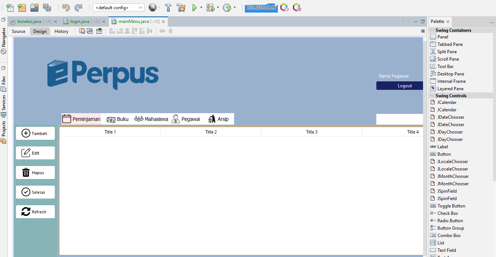

# Library Management System

## Project Description
The **Library Management System** is a desktop-based application developed using Java and NetBeans IDE. This system aims to facilitate the management of library resources such as books, members, and transactions. It simplifies processes such as book borrowing, returning, and inventory tracking while providing an efficient user interface for library administrators.

---

## Features
1. **Admin Dashboard**: Provides an overview of library activities, including borrowed and returned books.
2. **Book Management**:
   - Add, update, delete, and search for books.
   - Manage book details like title, author, genre, and availability.
3. **Member Management**:
   - Register new members.
   - Update member information.
   - View member borrowing history.
---

## Tools and Technologies
- **Programming Language**: Java
- **IDE**: NetBeans
- **Database**: MySQL
- **Libraries**: Swing for GUI development, JDBC for database connectivity

---

## Installation
1. **Prerequisites**:
   - Java Development Kit (JDK) installed (version 8 or above).
   - NetBeans IDE installed.
   - MySQL Server installed.

2. **Steps to Install**:
   - Clone the project repository or download the project zip file and extract it.
   - Import the project into NetBeans IDE.
   - Create a MySQL database named `perpustakaan`.
   - Execute the `perpustakaan.sql` script provided in the project files to set up the database structure and sample data.
   - Build and run the project from NetBeans.

---

## How to Use
1. Launch the application from NetBeans or the compiled JAR file.
2. Log in using admin credentials.
3. Navigate through the different sections of the system:
   - **Books**: Add or manage book inventory.
   - **Members**: Register new members or update member details.
4. Use the search bar to quickly locate books or members.

---

---

## Contribution
1. Fork the repository and clone it locally.
2. Create a new branch for your feature or bug fix.
3. Commit your changes and push to your branch.
4. Submit a pull request describing your changes.

---

## License
This project is licensed under the MIT License. See the `LICENSE` file for more details.

---

Thank you for using the Library Management System! Your feedback and contributions are highly appreciated.

